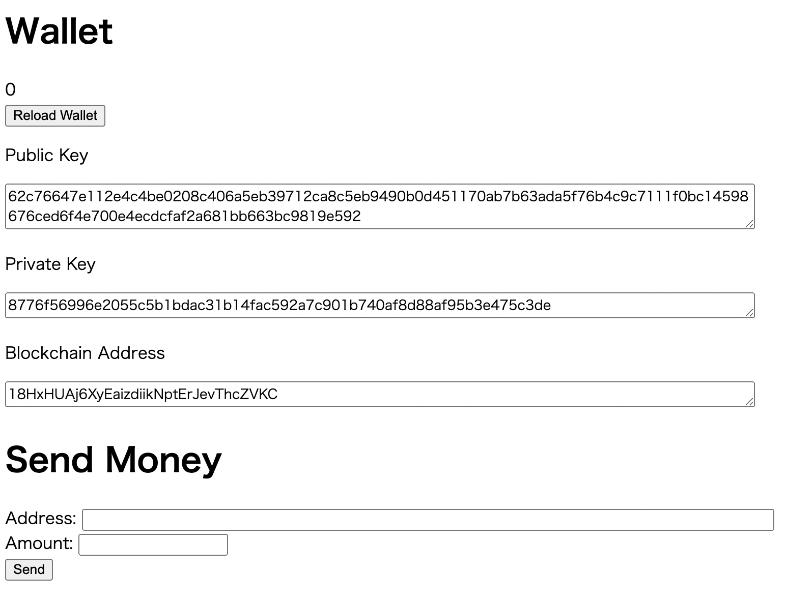
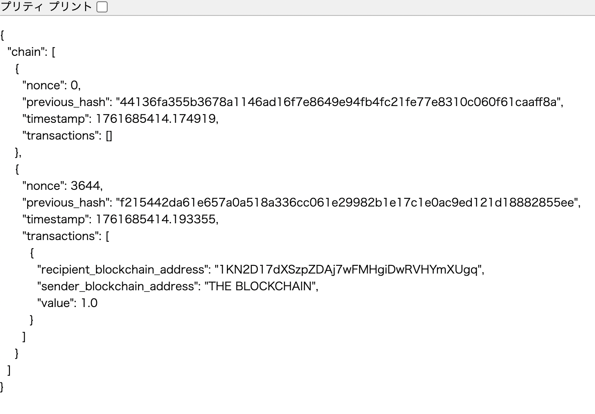

# Python Blockchain Implementation

Pythonでゼロから実装したブロックチェーンシステム

## 🌟 機能

- **ウォレット生成**: 秘密鍵・公開鍵・ブロックチェーンアドレスの生成
- **トランザクション作成**: デジタル署名による安全な送金
- **Proof of Workマイニング**: 難易度調整可能なマイニングアルゴリズム
- **P2Pネットワーク**: 複数ノード間でのブロックチェーン同期
- **コンセンサスアルゴリズム**: 最長チェーンルールによる合意形成
- **Web API**: Flask を使用したRESTful API
- **Webインターフェース**: ブラウザからの操作が可能

## 🛠 技術スタック

- **言語**: Python 3.x
- **Webフレームワーク**: Flask 3.1
- **暗号化**: ecdsa (楕円曲線暗号 NIST256p)
- **ハッシュ関数**: SHA-256, RIPEMD-160
- **エンコーディング**: Base58

## 📋 主な実装内容

### ブロックチェーン (blockchain.py)
- ブロック生成とチェーン管理
- Proof of Workアルゴリズム
- トランザクション検証
- ネットワーク同期
- コンセンサスアルゴリズム

### ウォレット (wallet.py)
- ECDSA暗号による鍵ペア生成
- Bitcoinスタイルのアドレス生成
- トランザクションのデジタル署名

### サーバー (blockchain_server.py, wallet_server.py)
- REST API エンドポイント
- ノード間通信
- Webインターフェース

## 📦 インストール

### 必要な環境
- Python 3.x
- pip

### セットアップ
```bash
# リポジトリをクローン
git clone https://github.com/code-craftsman369/python-blockchain.git
cd python-blockchain

# 必要なパッケージをインストール
pip install -r requirements.txt
```

## 🚀 使い方

### ブロックチェーンノードの起動
```bash
# ノード1を起動（ポート5001）
python blockchain_server.py -p 5001

# 別のターミナルでノード2を起動（ポート5002）
python blockchain_server.py -p 5002
```

### ウォレットサーバーの起動
```bash
# ウォレット1を起動（ポート8080）
python wallet_server.py -p 8080

# 別のターミナルでウォレット2を起動（ポート8081）
python wallet_server.py -p 8081 -g http://127.0.0.1:5002
```

### ブラウザでアクセス

- **ウォレット**: http://127.0.0.1:8080
- **ブロックチェーン確認**: http://127.0.0.1:5001/chain
- **トランザクション確認**: http://127.0.0.1:5001/transactions
- **マイニング実行**: http://127.0.0.1:5001/mine

## 📸 スクリーンショット

### ウォレット画面


ウォレットの生成、トランザクションの作成が可能です。

### ブロックチェーンデータ


ブロックチェーン全体のデータをJSON形式で確認できます。

## 🔗 API エンドポイント

### ブロックチェーンノード

| メソッド | エンドポイント | 説明 |
|---------|--------------|------|
| GET | /chain | ブロックチェーン全体を取得 |
| GET | /transactions | トランザクションプールを取得 |
| POST | /transactions | 新しいトランザクションを作成 |
| PUT | /transactions | トランザクションを追加 |
| DELETE | /transactions | トランザクションプールをクリア |
| GET | /mine | マイニングを1回実行 |
| GET | /mine/start | 自動マイニングを開始 |
| PUT | /consensus | コンセンサスアルゴリズムを実行 |
| GET | /amount | 指定アドレスの残高を取得 |

## 🎓 学習について

このプロジェクトは、Udemyのブロックチェーン講座を参考に実装しました。

### 学んだ内容
- ブロックチェーンの基本原理と仕組み
- 暗号学的ハッシュ関数の使用方法
- デジタル署名と公開鍵暗号の実装
- Proof of Workアルゴリズムの実装
- P2Pネットワークの構築方法
- RESTful API設計

コードには詳細なコメントとDocstringを追加し、
各関数の動作を理解しやすくしています。

## 📝 プロジェクト構成
```
python-blockchain/
├── blockchain.py           # ブロックチェーンのコア実装
├── wallet.py              # ウォレットとトランザクション
├── blockchain_server.py   # ブロックチェーンノードのAPIサーバー
├── wallet_server.py       # ウォレットのAPIサーバー
├── utils.py              # ユーティリティ関数
├── requirements.txt      # 依存パッケージ
└── templates/           # Webインターフェース用HTMLテンプレート
```

## 🔧 今後の改善予定

- [ ] より高度なコンセンサスアルゴリズム（Proof of Stake等）
- [ ] トランザクション手数料の実装
- [ ] Merkle Treeの実装
- [ ] データベースによる永続化
- [ ] テストコードの追加

## 📄 ライセンス

MIT License

## 👤 作成者

**Tatsu** - Python Developer

- GitHub: [@code-craftsman369](https://github.com/code-craftsman369)

## 🙏 謝辞

このプロジェクトは学習目的で作成されました。
Udemy講座の内容を参考にしながら、
ブロックチェーン技術の理解を深めることができました。
